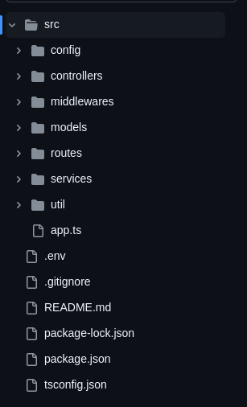

## Back-end

El proyecto utiliza **JavaScript/TypeScript** con **Express.js** como framework para servir los datos al Front-end desde una base de datos **Firestore**. Se han creado índices tanto para la búsqueda como para listar las tareas.

La autenticación está basada en **Firebase Authentication** a través de un servicio en Express. Se eligió **Express.js** por ser un framework robusto pero a la vez sencillo, lo que lo convierte en una excelente opción para este tipo de proyectos.

### Tecnologías utilizadas en el Back-end

- **JavaScript/TypeScript**
- **Express.js**
- **Firestore** (con índices para búsqueda y listado de tareas)
- **Firebase Authentication**

Estas tecnologías fueron seleccionadas por su robustez, así como por permitir un desarrollo rápido e intuitivo.

El proyecto sigue una estructura de datos fácil de entender, respetando estándares y convenciones.

### Estructura del proyecto

A continuación se muestra la estructura de carpetas del proyecto:

### Despliegue

El despliegue del API se realizó en **Google Cloud Functions**, mientras que la base de datos está alojada en **Firebase Firestore**.
